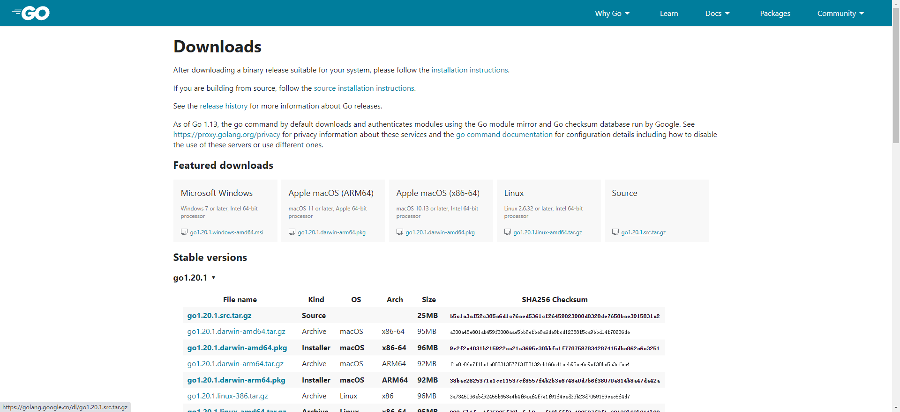

# 1.4 在 Linux 上安装部署Go
# 安装环境说明
Centos 7.9
Golang 1.18.3

# 安装步骤
官方下载页面：https://golang.google.cn/dl/

## 下载Golang
在官网选择自己需要的版本，复制下载链接下载
```shell 
wget -P /tmp/ https://golang.google.cn/dl/go1.18.3.linux-amd64.tar.gz 
```
## 解压tar包
```shell
 tar -xvzf /tmp/go$go_version.linux-amd64.tar.gz -C $HOME/go
 mv $HOME/go/go $HOME/go/go1.18.3
```

## 配置 Golang 环境
```bash
cat << EOF >> $HOME/.bashrc
# Go envs
export GOVERSION=go1.18.3 # Go 版本设置
export GO_INSTALL_DIR=\$HOME/go # Go 安装目录
export GOROOT=\$GO_INSTALL_DIR/\$GOVERSION # GOROOT 设置
export GOPATH=\$WORKSPACE/golang # GOPATH 设置
export PATH=\$GOROOT/bin:\$GOPATH/bin:\$PATH # 将 Go 语言自带的和通过 go install 安装的二进制文件加入到 PATH 路径中
export GO111MODULE="on" # 开启 Go moudles 特性
# export GOPROXY=https://goproxy.cn,direct # 安装 Go 模块时，代理服务器设置
export GOPRIVATE= # 跳转常用私有库
export GOSUMDB=off # 关闭校验 Go 依赖包的哈希值
EOF
```

## 验证Go安装情况和初始化Golang 工作区域
```bash
source $HOME/.bashrc && go version 
mkdir -p $GOPATH && cd $GOPATH && go work init
```

# 链接
* [目录](./directory.md)
* 上一页 [1.3 Go环境变量和安装后的目录清单](1-3.md)
* 下一页 [1.4 在 Linux 上安装部署Go](1-4.md)