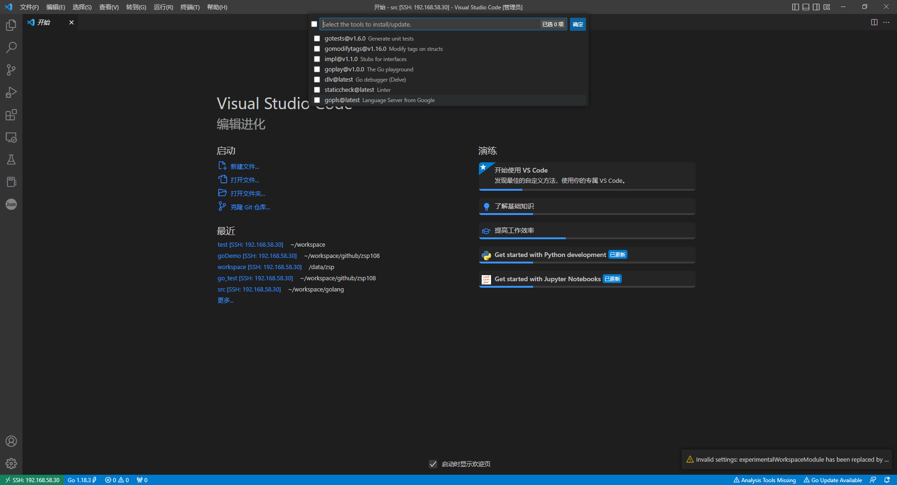

# 2.1 编辑器Visio Code
## Golang 编辑器
        Golang 支持Linux、Windows 和 Mac 系统，所以可以支持的编辑器也是多样化的，常用的有：Emacs、Vim、Xcode 6、KD Kate、TextWrangler、BBEdit、McEdit、TextMate、TextPad、JEdit、SciTE、Nano、Notepad++、Geany、SlickEdit、Visual Studio Code、IntelliJ IDEA 和 Sublime Text 2

        个人比较喜欢用VS Code,VS Code是开源免费的，而且有众多插件可以使用，支持各种语言，所以比较推荐使用Visual Studio Code
    
## VS Code 介绍
VSCode 全称 Visual Studio Code，是微软出的一款轻量级代码编辑器，免费、开源而且功能强大。它支持几乎所有主流的程序语言的语法高亮、智能代码补全、自定义热键、括号匹配、代码片段、代码对比 Diff、GIT 等特性，支持插件扩展，并针对网页开发和云端应用开发做了优化。软件跨平台支持 Win、Mac 以及 Linux。

## VS Code 插件推荐
* Remote - SSH (远程链接访问服务器工具)
* Markdown (Markdown 文档工具)
* Go (Golang 语言工具)
* json (Json 工具)

## VS Code 配置为GOlang开发工具步骤
### 下载安装VS Code

进入 https://code.visualstudio.com/download 找到自己要安装机器对应的版本下载

本人使用的是Windows 系统，所以以windows安装配置为例，除了安装步骤不同，其他的配置相似


下载完成后，打开下载文件，按提示一直下一步即可完成安装

安装完成后打开界面如下：


刚安装的VS Code 左侧边栏只有文件列表、搜索和插件三个选项，并且界面是英文界面，可以选择安装Chinese (Simplified) 插件汉化

所有插件都可以通过插件栏搜索安装，具体安装方式不具体讲述，接下来讲下Golang插件安装后需要更改的配置

插件栏搜索安装Golang后，需要再安装以下工具
- gtest
- gomodifytags
- impl
- goplay
- dlv
- staticcheck
- gopls

这些工具采用`go install `方式安装，所以安装这些工具之前最好先配置好GOPROXY，否则会出现工具下载失败的错误
GOPROXY可以使用go env或者写入 `~/.bashrc ` 等环境变量配置，看个人习惯，不过为了后续可以正常拉取安装GO模块，建议写入环境变量进行配置，国内配置的GOPROXY节点可以使用以下几个

```shell
go env -w GO111MODULE=on
go env -w GOPROXY=https://goproxy.io,direct
```
如果以上GOPROXY无法使用，可以替换为其他Proxy节点，
```
goproxy
https://goproxy.io/zh/
七牛云
https://goproxy.cn
阿里云
https://mirrors.aliyun.com/goproxy/
```
配置好GOPROXY后，就可以安装我们上面说的那些工具
打开 VS Code》帮助》显示所有命令(或者快捷键 ctrl + shift + P)
搜索 ` Go:Install/UpdataTools ` 选择安装以上工具



接下来就是配置VS Code 的gopls,如果没有配置的话,在非工作区域(也就是非GOPATH，或者多个工作区域创建的项目)会出现 `gopls was not able to find modules in your workspace` 的报错，查看报错下的文档可以看到以下说明：
https://github.com/golang/tools/blob/master/gopls/doc/workspace.md
```
One module 
If you are working with a single module, you can open the module root (the directory containing the go.mod file), a subdirectory within the module, or a parent directory containing the module.

Note: If you open a parent directory containing a module, it must only contain that single module. Otherwise, you are working with multiple modules.

Multiple modules 
Gopls has several alternatives for working on multiple modules simultaneously, described below. Starting with Go 1.18, Go workspaces are the preferred solution.

Multiple workspace folders 
If neither of the above solutions work, and your editor allows configuring the set of “workspace folders” used during your LSP session, you can still work on multiple modules by adding a workspace folder at each module root (the locations of go.mod files). This means that each module has its own scope, and features will not work across modules.

In VS Code, you can create a workspace folder by setting up a multi-root workspace. View the documentation for your editor plugin to learn how to configure a workspace folder in your editor.

```
看这么多东西，起始修复的地方就一个，打开VS Code》设置(快捷键：ctrl + ,)》搜索 ` Go:gopls ` ,打开下图的setting.json文件进行添加 ` "experimentalWorkspaceModule": true,` 配置


到这边就完成了VS Code Golang编译器的安装和工具配置了，如果是在远程服务器上开发的，可以使用 Remote - SSH 远程到安装好Golang环境的服务器进行配置，配置方法和以上配置相同

# 链接
* [目录](./directory.md)
* 上一页 [1.8 写个HelloWorld 吧](1-8.md)
* 下一页 [2.2 如何调试Go应用](2-2.md)