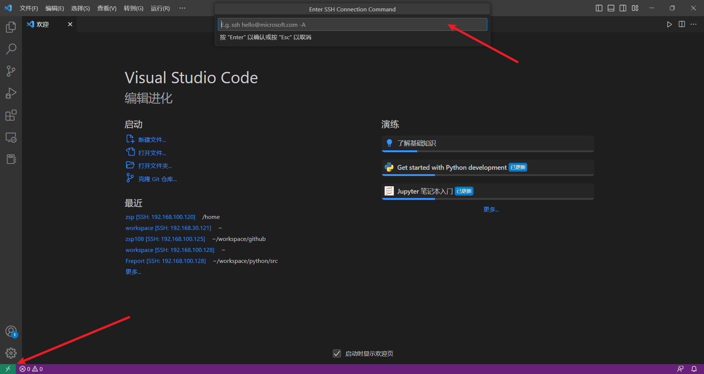

# 如何调试Go应用

每个语言在开发阶段总是避免不了需要进行调试，Go 调试可以使用gdb、delve(简称dlv),这些调试方法可以网上找下相关的资料学习下，例如：https://guidao.github.io/go_debug.html

除了 手动调试这种方法外，很多开发工具也支持安装插件或者自带调试，类似jetbrains 的Goland 编辑器，或者上篇文章介绍的VS Code，都可以实现调试运行

本示例以虚拟机或者服务器内安装配置好Go环境，然后使用GDB调试方法 和VS Code远程链接进行开发调试编译。

## 基础环境搭建
### 1. 服务器安装Go环境

安装过程方式详见：[在 Linux 上安装部署Go](1-4.md)


## GDB 调试Go程序
### 2. GDB工具安装和Go语言GDB调试支持文件
建议使用GDB 7.1+
如果没有安装的话使用对应的yum 或apt搜索下软件仓库是否有gdb-7.1+的，直接install即可。如果没有对应版本，请百度/Google解决办法。
然后加载GDB调试支持文件
```bash
$GOROOT/src/runtime/runtime-gdb.py
```
加载成功后gdb显示：`Loading Go Runtime support.`
gdb 的help info 和help function 会对应新增一些新增的命令 和函数，
比如使用新增的cap函数：
```bash
p $cap(slicea)
```

### 3. 编译go程序
```bash
go build -gcflags=all="-N -l" -o {二进制文件名称} {go文件或整个项目}
```
### 4. 运行编译出来的二进制文件并获取其PID，使用gdb进行调试
```bash
./{二进制文件名称}
ps -ef | grep {二进制文件名称}

#开始调试
gdb -p pid
```

### 5. 常用的GDB命令
以下部分内容来自：https://blog.csdn.net/qq_27071221/article/details/123002060
- 查看协程和线程
```bash
    info goroutines
    info threads
    # 在某个协程上执行gdb命令，比如查看2号协程的栈帧：
    goroutine 2 bt
    # 切换当前线程：
    thread {线程号}
```
- 查看slice
```bash
len：p $len(slicea)
cap：p $cap(slicea)
array：p slicea.array[0]
```
- go用户程序入口断点和其他常用断点
```bash
# 设置断点：b 行号|函数|
# 清除断点：delete [breakpoints num] [range…]
# 显示断点：info breakpoints
# 条件断点：b fn1 if a＞b
# break n （简写b n）:在第n行处设置断点
# （可以带上代码路径和代码名称： b OAGUPDATE.cpp:578）
# b fn1 if a＞b：条件断点设置
# break func（break缩写为b）：在函数func()的入口处设置断点，如：break cb_button
# delete 断点号n：删除第n个断点
# disable 断点号n：暂停第n个断点
# enable 断点号n：开启第n个断点
# clear 行号n：清除第n行的断点
# info b （info breakpoints） ：显示当前程序的断点设置情况
# delete breakpoints：清除所有断点：


# 主程序断点
b main.main

# 其他常用断点
# lock
b runtime.futex
channel：
b runtime.chansend
b runtime.chanrecv

# 调度
b runtime.schedule
b runtime.save
b runtime.newm
b runtime.newproc
b runtime.osyield
b runtime.pidleput
b runtime.stopm

# 系统调用
b syscall.read
b syscall.write
b syscall.Syscall
b syscall.Syscall6
b syscall.RawSyscall
b syscall.RawSyscall6
b runtime.entersyscall
b runtime.exitsyscall
b runtime.Gosched

# 指定文件位置打断点
b xxx.go:90

```

- 其他常用命令
```bash
# 执行下一步
c 

# 打印出出错的堆栈信息数据
bt


```


## VS Code + dlv调试Go程序

### 2. VS Code 安装

VS Code 安装详见[编辑器Visio Code](2-2.md)

### 3. 安装VS Code ssh和Go插件

插件名称：
Remote - SSH


Go


SSH插件安装后可以直接使用ssh远程访问到我们的开发服务器上

点击左下角的ssh工具,输入 `` ssh 账号@IP `` 后，根据提示输入密码和确定访问即可 


链接到远程服务器后，Go插件需要安装以下工具
```
gotests@v1.5.0
gomodifytags@v1.16.
impl@v1.1.0
goplay@v1.0.0
dlv@latest
staticcheck@latest
gopls@latest
```
从左下角小齿轮或者快捷键 `ctrl+shift+p` 打开命令面板搜索`Go:install/update tools`,需要哪些工具安装哪些，为了方便我直接全部安装(提示！这些工具是会由于网络问题下载失败，可以考虑设置好GOPROXY后再进行下载安装，常见Go代理有：
* goproxy
https://goproxy.io/zh/
* 七牛云
https://goproxy.cn
* 阿里云
https://mirrors.aliyun.com/goproxy/
)


### 4. 设置调试launch.json文件

首次需要创建launch.json文件


Go的调试配置文件有以下集中配置可选：

__Connect to server(本文采用该配置)__ 
```
{
    "name": "Go Debug",
    "type": "go",
    "request": "attach",
    "mode": "remote",
    // 注意！！remotePath非常关键，这是能否成功设置断点的关键参数。它不是进程当前的目录，也不是本地项目的代码目录，而是编译二进制项目的目录。
    // "remotePath": "${workspaceFolder}",
    "remotePath": "${workspaceFolder}",
    "port": 2345,
    "host": "127.0.0.1"
}
```


Attach to local process
```
{
    "name": "Launch file",
    "type": "go",
    "request": "launch",
    "mode": "debug",
    "program": "${file}"
}
```
Launch file
```
{
    "name": "Launch file",
    "type": "go",
    "request": "launch",
    "mode": "debug",
    "program": "${file}"
}
```
Launch package
```
{
    "name": "Launch Package",
    "type": "go",
    "request": "launch",
    "mode": "debug",
    "program": "${workspaceFolder}"
}
```
Launch test function
```
{
    "name": "Launch test function",
    "type": "go",
    "request": "launch",
    "mode": "test",
    "program": "${workspaceFolder}",
    "args": [
        "-test.run",
        "MyTestFunction"
    ]
}
```
Launch test package
```
{
    "name": "Launch test package",
    "type": "go",
    "request": "launch",
    "mode": "test",
    "program": "${workspaceFolder}"
}
```

如上所示，其中用到几个环境变量：

- file：当前文件绝对路径

- workspaceFolder：工作区目录绝对路径

- fileDirname：当前文件所在目录绝对路径


### 5. 启动远程调试程序

设置`go env -w GO111MODULE=on` 后，在项目根目录下执行`go mod init <项目名称>`

#### 方法一：

在项目根目录下执行
```bash
dlv debug --headless --listen ":2345" --log --api-version 2
```
#### 方法二：
- 用下列命令编译代码

```bash
go build -gcflags="all=-N -l" -o {二进制文件名称} {go文件或整个项目}
```

- 运行二进制文件

- 用下列命令查看PID

```bash
ps -aux | grep {二进制文件名称}
```

- 用下列命令启动pid attach

    dlv --listen=:2345 --headless=true --api-version=2 attach {PID}


### 6. VS Code 调试
在VSCode 界面上点击左侧栏的调试工具，使用刚才配置的“Launch remote”方案，点击启动即可远程调试，和本地调试无异，堆栈、变量、watch都能正常使用。


# 链接
* [目录](./directory.md)
* 上一页 [2.2 编辑器Visio Code](2-2.md)
* 下一页 [2.4 如何编译Go应用](2-4.md)