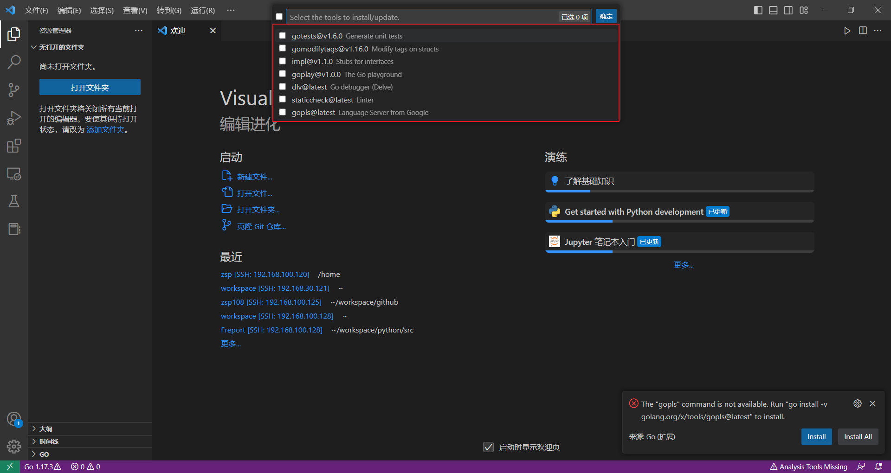

# 如何调试Go应用

每个语言在开发阶段总是避免不了需要进行调试，Go 调试可以使用gdb、delve(简称dlv),这些调试方法可以网上找下相关的资料学习下，例如：https://guidao.github.io/go_debug.html

除了 手动调试这种方法外，很多开发工具也支持安装插件或者自带调试，类似jetbrains 的Goland 编辑器，或者上篇文章介绍的VS Code，都可以实现调试运行，由于个人习惯用VS Code ，所以本篇文章以VS Code 调试方法为例进行配置讲解

本示例以虚拟机或者服务器内安装配置好Go环境，然后使用VS Code远程链接进行开发调试和编译，

1. 服务器安装Go环境

安装过程方式详见：[在 Linux 上安装部署Go](1-4.md)

2. VS Code 安装

VS Code 安装详见[编辑器Visio Code](2-2.md)

3. 安装VS Code ssh和Go插件

插件名称：
Remote - SSH


Go


SSH插件安装后可以直接使用ssh远程访问到我们的开发服务器上

点击左下角的ssh工具,输入 `` ssh 账号@IP `` 后，根据提示输入密码和确定访问即可 


链接到远程服务器后，Go插件需要安装以下工具
```
gotests@v1.5.0
gomodifytags@v1.16.
impl@v1.1.0
goplay@v1.0.0
dlv@latest
staticcheck@latest
gopls@latest
```
从左下角小齿轮或者快捷键 `ctrl+shift+p` 打开命令面板搜索`Go:install/update tools`,需要哪些工具安装哪些，为了方便我直接全部安装(提示！这些工具是会由于网络问题下载失败，可以考虑设置好GOPROXY后再进行下载安装，常见Go代理有：
* goproxy
https://goproxy.io/zh/
* 七牛云
https://goproxy.cn
* 阿里云
https://mirrors.aliyun.com/goproxy/
)



4. 设置调试launch.json文件

首次需要创建launch.json文件


Go的调试配置文件有以下集中配置可选：
Attach to local process
```
{
    "name": "Launch file",
    "type": "go",
    "request": "launch",
    "mode": "debug",
    "program": "${file}"
}
```
Connect to server
```
{
    "name": "Connect to server",
    "type": "go",
    "request": "attach",
    "mode": "remote",
    "remotePath": "${workspaceFolder}",
    "port": 2345,
    "host": "127.0.0.1"
}
```
Launch file
```
{
    "name": "Launch file",
    "type": "go",
    "request": "launch",
    "mode": "debug",
    "program": "${file}"
}
```
Launch package
```
{
    "name": "Launch Package",
    "type": "go",
    "request": "launch",
    "mode": "debug",
    "program": "${workspaceFolder}"
}
```
Launch test function
```
{
    "name": "Launch test function",
    "type": "go",
    "request": "launch",
    "mode": "test",
    "program": "${workspaceFolder}",
    "args": [
        "-test.run",
        "MyTestFunction"
    ]
}
```
Launch test package
```
{
    "name": "Launch test package",
    "type": "go",
    "request": "launch",
    "mode": "test",
    "program": "${workspaceFolder}"
}
```
如上所示，其中用到几个环境变量：

- file：当前文件绝对路径

- workspaceFolder：工作区目录绝对路径

- fileDirname：当前文件所在目录绝对路径


5. 调试程序

一定要设置好`go env -w GO111MODULE=on` 后，在文件夹下执行`go mod init <项目名称>`
- 用下列命令编译代码

    go build -gcflags="all=-N -l" -o {二进制文件名称}

- 运行二进制文件

- 用下列命令查看PID

    ps -aux | grep {二进制文件名称}

- 用下列命令启动pid attach

    dlv --listen=:{port} --headless=true --api-version=2 attach {PID}


https://zhongpan.tech/2019/10/21/016-remote-debug-golang-with-vscode/


# 链接
* [目录](./directory.md)
* 上一页 [2.2 编辑器Visio Code](2-2.md)
* 下一页 [2.4 如何编译Go应用](2-4.md)